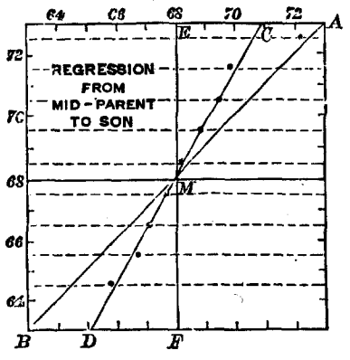

# Introduction: neurons, models and outliers {#intro}

`r if (knitr::is_latex_output()) '\\pagenumbering{arabic}
\\setcounter{page}{1}'`

Statistics, like all science, are man-made. Acceptance of their presuppositions depends on human intuition of how to model connections between variables, what distributional assumptions make sense -- and what constitutes an outlier. In many cases, these presuppositions are straightforward and we seldomly question them. This makes sense, of course. It is impossible to make progress if we questioned our most basic assumptions all the time. Before going on to outlier analysis, however, let us briefly revisit the beginnings of statistics. Francis Galton, an early pioneer of regression analysis, discovered a curious connection when analyzing body height of parents and their children.

```{r galton-1, out.width='50%', warning=FALSE, message=FALSE, fig.cap='(ref:galton-1)', echo=FALSE}
require(psych)
require(ggplot2)
data(galton)
ggplot(galton, aes(x = parent, y = child)) + geom_point() + theme_minimal() + theme(axis.title = element_text(size = 15), axis.text = element_text(size = 15)) + labs(x = 'Body height children (in)', y = 'Average body height parents (in)')
```

(ref:galton-1) Galton's heredity data in the `psych` package [@R-psych, dataset `galton`]

Whereas taller parents had taller children, the offspring of particularly tall parents was smaller than them wheareas smaller parents' children had a relatively large body height. In an attempt to characterize the connection he drew a line with a slope of 2/3. [@Galton1889, p. 96f.] Regression analysis has come a far way since then. His successors determined the more rigorous method of least squares to compute linear models. The slope determined by this method is 0.65; Galton's visual estimation[^1] had therefore been quite accurate.

```{r galton-2, out.width='50%', warning=FALSE, message=FALSE, fig.cap='(ref:galton-2)', echo=FALSE, fig.show='hold'}
# Workaround
require(png)
require(grid)
img <- readPNG("figs/galton.png")
g <- rasterGrob(img, interpolate=TRUE)
qplot(1:10, 1:10, geom="blank") +
  annotation_custom(g, xmin=-Inf, xmax=Inf, ymin=-Inf, ymax=Inf) + 
  theme_void()
# 
ggplot(galton, aes(x = child, y = parent)) + geom_point() + geom_smooth(method = "lm", se = FALSE) + coord_flip() + theme_minimal() + theme(axis.title = element_text(size = 15), axis.text = element_text(size = 15)) + labs(x = 'Body height children (in)', y = 'Average body height parents (in)')
```

(ref:galton-2) Left: Galton's original estimation (the line connecting C and D). Right: Least Squares linear model. Note that the x -axis now represents the parents' height wheareas the childrens' height is drawn on the y-axis.

[^1]: reproduced from Galton [-@Galton1889, p. 96]

The mathematical formulation of regression allowed for a more rigorous analysis and an extension to multivariate analysis -- after all, visual estimation of a 10-dimensional hyperplance is not feasible. Since then, many extensions and alternative formulations have yielded methods that can model arbitrarily complex relationships and handle various formats of data. In many cases, however, the linear model still provides the basis for the analysis. There are certainly mathematical advantages of this approach; another important reason is that we can easily grasp linear connections -- rules like "if the parents are three inch taller, the children are, on the average, two inch taller" are immediately clear. One might even say that we are wired to understand correlation, as the Hebbian rule maintains that synaptic connection adapt by learning correlations between neuronal firing rates [see @Hebb1949, @Gerstner2002]. A statistical approach that is grounded in the linear model is therefore a sensible formalization of our intuition.

