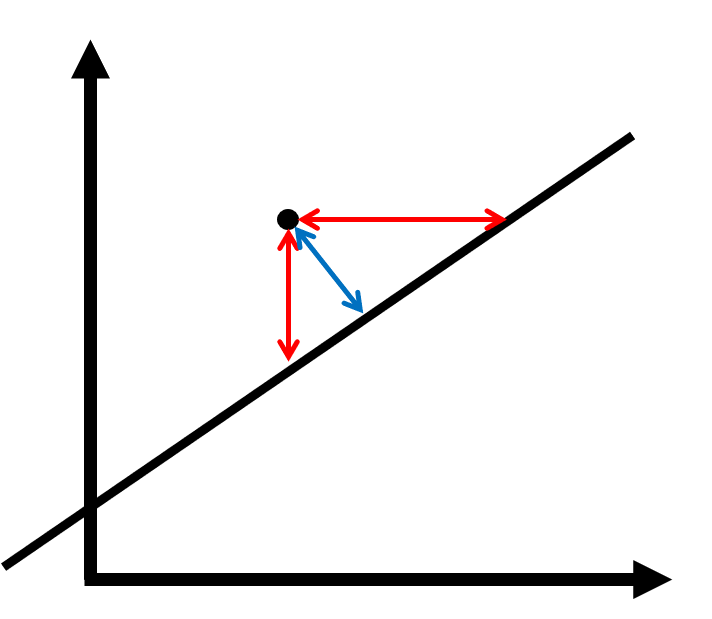

# Linear Outlier Detection {#linear}

Regression starts with a linear model -- many nonlinear methods are essentially extensions of linear methods. It is therefore sensible to begin this exposition with the linear methods, as well. We will first discuss linear models and then go on to discuss principal component analysis.

## Linear Models {#linear-model}

Linear Models are the most common regression technique and therefore a fitting start for a discussion of outlier detection algorithms using regression.

### Motivation

Consider a few examples: suppose we compare the performance of students a lecture with their grades after the exam. Alternatively, we compare the level of education with the pay grade or the forecast with the actual weather. In all these cases, our intuition for outliers is rather clear: how strongly does the latter dimension deviate from the prediction of the former? These are **instances** of a directed model which may be implemented by a linear model. We therefore extract a certain feature which should conform to the prediction by the other feature. A larger deviation would imply a stronger possibility that a certain data point is an outlier.

### Definition and implementation in R

```{definition}
Consider data points $i\in\{1,\dotsc,n\}$ with covariates $X\in\mathbb{R}^{n\times p}$ and a predicted variable $Y\in\mathbb{R}^n$. *Outlier detection with a linear model* first estimates the least squares fit of the linear model and then predicts all data points from their covariates. The deviation $|\hat{y}_i-y_i|$ is the resulting outlier score.
```

The implementation is simple:

1. Fit a linear model with the function `lm`.

2. Predict the data points and determine the residuals with `predict`.

### Example application

```{r lin-ex, echo = FALSE, fig.cap = "Outlier detection using linear models"}
dfs <- list(df_lin, df_circ, df_square, df_trig)
models <- 
  dfs %>% 
  map(~ lm(V2 ~ V1, data = .))
lin_grid <- 
  grid %>% 
  map2(models, 
       function(x, y) {
         pred <- predict(y, newdata = x)
         mutate(x,
                linear_outlier = abs(pred - V2),
                linear_ZScore = linear_outlier / 
                  sqrt(sum(y$residuals^2) / length(y$residuals)))
       })
titles <- c("Linear pattern", "Circular pattern", 
            "Quadratic pattern", "Sinusoidal pattern")
p <- 
  lin_grid %>% 
  map(
    ~ zplot(., "V1", "V2", "linear_ZScore", show.legend = FALSE)
  ) %>% {
    pmap(
    list(., titles, dfs),
    function(x, y, z) {
      x + 
      labs(title = y) + 
      geom_point(data = z, 
                 mapping = aes(fill = NULL, shape = outlier),
                 show.legend = FALSE,
                 alpha = .3)
    }
  )
  } %>% 
  reduce(`+`) + 
  plot_layout(ncol = 2, nrow = 2)
p
```

The application of this method to the example data can be found in figure \@ref(fig:lin-ex). The linear pattern is recognized rather well which is partly due to the evenly distributed outliers. The algorithm fails to recognize the correct patterns in the nonlinear cases for obvious reasons.

### Data compression and correction

Data compression would be achieved by leaving out the predicted variable and decoding the compressed pattern by predicting it according to the fitted linear model. Data correction would correspond to replacing the true value of the predicted variable by its prediction from the other variables.

### Discussion

It is important to emphasize at this point that such a simple model will scarcely be useful for many different reasons. From a practical point of view, the dynamics in most real-world datasets cannot be captured by a linear assumption. This restriction applies to all methods in this chapter. However, this method can easily be extended to arbitrary regressions which are able to capture more complex relationships. This enables us to extract features, prevent overfitting and adress other issues with the help of regression methods. On the other hand, special knowledge is necessary to apply a directed model -- after all, we need to know which variable to predict. In the aforementioned examples, this has worked -- in particular, these methods may often be applied in a spatiotemporal context [@Aggarwal2017, ch. 9 and 11] in which we predict data at time point $t$ with the data at time point $t-1$, for instance. In many cases, however, there is no obvious special variable to predict. @Paulheim2015 presented the *ALSO approach* which essentially fits a regression for every variable. This approach has the advantage that it requires no special knowledge while retaining the adaptability of these regression methods.

It is also important that many regression methods are susceptible to the very problem they must adress in this context, namely outliers. @Fahrmeir2013 point out that even a single outlier may affect the fitted hyperplane to an arbitrarily large degree. In order to solve this issue, it is possible to use an iterated approach where in the first step, we attempt to characterize the outliers and then fit another regression after removing the obvious outliers. Several iterations would possibly adress this issue. This approach may be discussed within the more general context of *ensemble methods* which @Aggarwal2017 adresses in chapter 6. This is, however beyond the scope of this report.

## Principal Component Analysis {#linear-pca}

### Motivation

Another possibility to remove the directedness of the approach in the last section is by considering the *orthogonal prediction error*. Consider figure \@ref(fig:ortho).

```{r ortho, echo = FALSE, fig.cap = "Orthogonal error (blue) and directed error (red)", fig.align='center', out.width = '50%'}

```

A directed regression would attempt to minimize the length of one of the red arrows. In contrast, *orthogonal regression* attempts to minimize the orthogonal error, which corresponds to the blue arrow. This regression method is symmetrical which removes the choice of the predicted variable. It can be shown that this task is equivalent to the following two tasks:

* Solving a regression problem where all variables are used as covariates, the predicted variable $Y$ is constantly zero and the regression coefficients as a vector have unit norm,
* Determining the linear combination with the least variance, i. e. the last principal component.

Principal component analysis (PCA) is therefore a natural extension of orthogonal regression which we will explore in this section.

### Definition

As PCA is covered in most undergraduate degrees in statistics, I will leave out the mathematical definition and refer the interested reader to chapter 11 of @Hardle2015. Intuitively, a PCA attempts to capture as much information within the first linear combinations of the variables as possible. The different principal components are therefore uncorrelated. This approach is especially sensible in cases where high dimensionality poses a problem, in particular if humans need to deal with the data. Usually, a cutoff point $k$ is chosen and only the first $k$ prinicipal components are retained. In order to chose this cutoff point, different techniques are possible.

```{definition}
Consider data points $i\in\{1,\dotsc,n\}$ with the observations $X\in\mathbb{R}^{n\times p}$. *Outlier detection with PCA* first identifies the matrices 
$$
  P=\begin{pmatrix}P_1&\dotsb&P_p\end{pmatrix}\in\mathbb{R}^{p\times p},\Lambda = \text{diag}(\lambda_1,\dotsc,\lambda_p),\lambda_i\ge\lambda_{i+1}\ge0
$$
such that
$$
  P^TP=I, X^TX=P\Lambda^2P^T.
$$
The principal components $T_j:=XP_j$ are computed. By assumption, the last principal components are mainly driven by noise. If they are larger, the outlier score should be as well. As $\lambda_i$ is the standard deviation of $P_i$, the outlier score is defined as
$$
  \left(\sum_{i=k+1}^p\lambda_i^{-2}T_i^2\right)^{\frac{1}{2}}.
$$
```

In the case of outlier analysis, the cutoff point is often assumed to be zero, i. e. we computed the weighted average squares of all principal components. This is because the cutoff point introduces a new parameter and these parameters are especially difficult to fit in the context of outlier analysis. On the other hand, we can scarcely make an informed choice regarding the cutoff point as principal components almost never have an intuitive interpretation. In particular, discarding the need for an informed choice was our initial motivation for principal components analysis. Furthermore, the standard deviation of the first principal components is usually large and their variation does not have a huge influence on the outlier score, anyway.

In R, this method may be implemented by the following steps:

1. Fit the principal components analysis using `prcomp`, e. g.: `model <- prcomp(x)`.
2. Predict the principal components using `predict`, e. g.: `pcs <- predict(model)`.
3. Compute the score. You can access the standard deviations of the different principal components via the `sdev` element of the list which `prcomp` returns, e. g.: `score <- pcs ^ 2 %*% model$sdev`.

### Example application

Figure \@ref(fig:pca-ex) shows the result of the PCA outlier detection.

```{r pca-ex, echo = FALSE, fig.cap = "Outlier detection using principal components analysis"}
dfs <- list(df_lin, df_circ, df_square, df_trig)
models <- 
  dfs %>% 
  map(~ prcomp(~ V1 + V2, data = .))
pca_grid <- 
  grid %>% 
  map2(models, 
       function(x, y) {
         pred <- predict(y, newdata = x)
         mutate(x,
                pca_outlier = pred^2 %*% y$sdev^(-2),
                pca_ZScore = pca_outlier / sqrt((sum(y$rotation^2 %*% y$sdev^(-2)) /
                                                   nrow(y$rotation))))
       })
titles <- c("Linear pattern", "Circular pattern", 
            "Quadratic pattern", "Sinusoidal pattern")
p <- 
  pca_grid %>% 
  map(
    ~ zplot(., "V1", "V2", "pca_ZScore", show.legend = FALSE)
  ) %>% {
    pmap(
    list(., titles, dfs),
    function(x, y, z) {
      x + 
      labs(title = y) + 
      geom_point(data = z, 
                 mapping = aes(fill = NULL, shape = outlier),
                 show.legend = FALSE,
                 alpha = .3)
    }
  )
  } %>% 
  reduce(`+`) + 
  plot_layout(ncol = 2, nrow = 2)
p
```

Notably, the outlier score now has elliptic levels (in contrast, the linear model yielded straight levels). This demonstrates that both principal components are part of our outlier score. In the case of the linear pattern, the assumption that both dimensions are relevant to the outliers is simply wrong which is why the pattern recognition is not accurate. In the circular case, the method actually recognizes that the points outside the circle are outliers. Due to the method's linear assumption, it is not able to recognize that there are outliers within the circle as well. The method is not adept at recognizing the quadratic and sinusoidal pattern either.

### Data compression and correction

With principal component analysis, data may be compressed arbitrarily strongly, as we may discard as many principal components as we would like. Encoding would therefore happen by computing $T=XP$ and discarding the last principal components. $\tilde{X}=TP^T$ would decode $T$. The data may also be corrected in this way. The underlying assumption is that the last components are driven by noise and the correct value is therefore likely to be constant, i. e. zero.

Both compression and correction require a *hard PCA*, i. e. one with non-trivial cutoff points. This comes with its advantages and disadvantages.

### Discussion

In the context of outlier analysis, a soft PCA is mostly a better choice than a hard PCA for the aforementioned reasons and we have solved the problem of assymmetry which we had with the linear model. On the other hand, the PCA is still restricted by linear assumptions. In particular, the soft PCA is equivalent to the *Mahalanobis score*, a simple probabilistic outlier score. The point of using principal components analysis, however, is that we can find a non-linear extension and the so called *kernel trick* which enables us to do that will be the subject of the first section in the next chapter. This computational technique was developed for Support Vector Machines (SVMs), a popular Machine Learning Algorithm [@Aggarwal2015, section 10.6]. Indeed, SVMs have found their way into outlier analysis, as well. However, their performance depends on the choice of certain hyperparameters in an intransparent manner and this method is therefore less reliable. [@Manevitz2001] As introducing SVMs would require introducing Lagrange optimizers, I have decided to discard this technique for the present report.

Finally, I will point out that besides the non-linear extensions which we will discuss, techniques have been developed to fit PCA to noisy or missing data [@Bailey2012] which can be of use in the context of outlier detection, as well.
