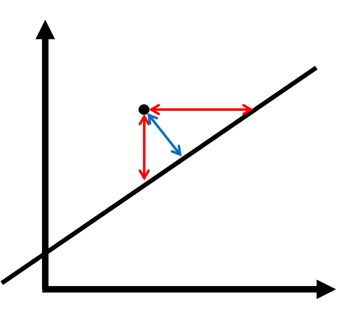

--- 
author: "Samuel Lippl"
date: "`r Sys.Date()`"
site: bookdown::bookdown_site
documentclass: report
subparagraph: true
bibliography: [outlier-detection.bib]
biblio-style: apalike
link-citations: yes
description: "This article is concerned with outlier detection using regression in R."
---

# Abstract {-}

This report will provide an overview over outlier detection in R. It starts by discussing some general principles of outlier detection. Linear methods and their nonlinear extensions are presented next. Along the general methods, examples of application and an appropriate methodology in R are introduced.

```{r setup, echo = FALSE, warning = FALSE, error = FALSE, message = FALSE}
library(kernlab)
library(tidyverse)
library(scico)
library(scales)
library(magrittr)
library(MASS)
library(patchwork)
library(gganimate)
library(purrr)
my_theme <- theme_minimal()
```

`r if (knitr::is_latex_output()) '\\tableofcontents'`

<!--chapter:end:index.Rmd-->

# Introduction: neurons, models and outliers {#intro}

`r if (knitr::is_latex_output()) '\\pagenumbering{arabic}
\\setcounter{page}{1}'`

In the late 1990s, neuroscientists faced a curious problem. They investigated a set of neurons which started to fire when a bar with a certain orientation appeared within their receptive field, i. e. the visual area these neurons were concerned with. However, when this bar extended their receptive field, the firing stopped. This behaviour is called *endstopping*.

```{r endstopping, echo=FALSE, message=FALSE, fig.cap='(ref:endstopping)', out.width="100%",  fig.asp=if(knitr::is_html_output()) 0.33 else 1}
df <- tribble(
  ~xmin, ~xmax, ~ymin, ~ymax, ~seq, ~colour, ~alpha,
  4.5, 4.5, 1, 2, 1, "grey", 0,
  4, 5, 1, 2, 2, "darkorange1", 1, 
  1, 8, 1, 2, 3, "grey", 1
)
df2 <- df[c(1:3, 2),]
df2$seq[4] <- 4
if(knitr::is_html_output()) {
  ggplot(df2, aes(xmin = xmin, xmax = xmax, ymin = ymin, ymax = ymax)) + theme_void() + scale_x_continuous(limits = c(0, 9)) + scale_y_continuous(limits = c(0, 3)) + geom_rect(aes(xmin = 3, xmax = 6, ymin = 0, ymax = 3, fill = colour), show.legend = FALSE, alpha = .5) + scale_fill_identity() + geom_rect(aes(xmin = 0, xmax = 9, ymin = 0, ymax = 3), colour = "black", fill = NA) + geom_rect(fill = "black", mapping = aes(alpha = alpha), show.legend = FALSE) + scale_alpha_identity() + transition_states(seq, transition_length = 2, state_length = 1)
}
if(!knitr::is_html_output()) {
  ggplot(df, aes(xmin = xmin, xmax = xmax, ymin = ymin, ymax = ymax)) + theme_void() + scale_x_continuous(limits = c(0, 9)) + scale_y_continuous(limits = c(0, 3)) + geom_rect(aes(xmin = 3, xmax = 6, ymin = 0, ymax = 3, fill = colour), show.legend = FALSE, alpha = .5) + scale_fill_identity() + geom_rect(aes(xmin = 0, xmax = 9, ymin = 0, ymax = 3), colour = "black", fill = NA) + geom_rect(fill = "black", mapping = aes(alpha = alpha), show.legend = FALSE) + scale_alpha_identity() + facet_grid(rows = vars(seq))
}
```

(ref:endstopping) Illustration of endstopping: The shaded rectangle shows the receptive field of the neuron. The black rectangle represents the bar. If the receptive field is grey, the neuron does not fire, if it is orange, the neuron fires.

Different functions of these endstopped neurons had been postulated. Studies had suggested a role for these cells in detecting curvature, line terminations, occlusion, perceptual grouping and illusory contours. [@Rao1999] Rao and Ballard's study presented an alternative explanation for this effect. Their analysis suggested that higher-level neurons whose receptive field resembled the entire area in figure \@ref(fig:endstopping) predicted the lower-level input. Feedback connections transmitted the error of the transmission. According to Rao and Ballard, the endstopped neurons had the function of error feedback.

They demonstrated this by fitting a hierarchical model with three layers on image patches extracted from five natural photos such that the higher-level layers optimally predicted the lower-level layers. The feedback nodes encoding the difference between the values in the second layer and the values that had been predicted by the third layer exhibited endstopping effects. [@Rao1999]

The explanation for neuronal endstopping therefore consists of two parts: firstly, the structure of neuronal networks allow for association of neighbouring pixels which is necessary to detect bars. Secondly, short bars are less usual than longer bars[^1]. This is the reason why the higher-level neurons predict a longer bar in these cases and receive a higher error feedback signal. Short bars are therefore *outliers*. Endstopped neurons thus provide a natural example for outlier detection.

[^1]: Rao and Ballard demonstrated this by another investigation [@Rao1999].

Since these investigation, predictive coding, the hypothesis that higher-level neuronal layers attempt to predict lower-level layers, has become popular with respect to different areas of the brain [@Friston2005]. Intuitively, this makes sense: if the received input represents usual patterns the information of the higher-level neurons suffices so that lower-level correction is only required if something unusual happens. This allows the brain to build a model of reality as such a model cannot account for all irregularities and retain its descriptive power. Consider, for instance, a chess game where the player attempts to predict his opponent's actions. It is impossible to consider all possible moves. Instead, the player has to restrict himself to the most probable ones. If the next move has been considered by the player, his opponent behaves in the usual way and the player can rest assured. In contrast, if the player has not considered the next move, he may be alerted. Unusual behavior therefore merits special attention, in particular, if it is impossible to model all paths of behavior.

The statistical implementation of this strategy is given by outlier detection. The examples are manifold:

* It is impossible to model all possible methods to commit credit card fraud. Instead, we simply try to detect unusual behavior.
* There are many different reasons why data points may deviate from the assumptions of the classical linear model but many of these deviations are observable by looking at different kinds of residual errors.
* There are many different reasons why a sensor can be corrupted and not all of them can be considered. However, many of them manifest themselves in unusual patterns.

*Outliers* can now be defined as those data points that are *dissimilar from the other data points* [see @Aggarwal2017]. The particular outlier detection methods defines what it means for data points to be similar to each other. For instance, with respect to the endstopping neurons, image patches are similar if they can be characterized by the same neuronal model.

This report focuses on methods that generate predictions and assess them in order to judge how *usual* a certain data point is. Its structure is based on chapter 3 of Aggarwal's *Outlier Analysis* [-@Aggarwal2017]. Two alternative popular approaches are probabilistic modeling [@Aggarwal2017, ch. 2] and clustering [@Aggarwal2017, ch. 4]. Note that the distinction is not well-defined and there are many methods that can be attributed to different fields (see [chapter 2](#methods)).

[Chapter 2](#methods) presents a general methodology to assess outlier scores and introduces the *Z-plot* as a visualization of outlier scores..

Subsequently, [chapter 3](#linear) introduces outlier detection using linear models and principal component analysis. All these methods are limited by the fact that they can only model linear relationships. This disadvantage is adressed in [chapter 4](#nonlinear) where nonlinear extensions of these methods are introduced. Specifically, the kernel trick is introduced yielding kernel principal component analysis. Finally, more complex regressions, in particular neural networks, are introduced. Methodological instructions consist of the following parts:

* **Motivation** and **intuition**: What does it mean for a data point to be usual? What hyperparameters need to be adjusted and how do they affect whether data points are usual?
* **Implementation** in R
* Example **application**: a two-dimensional outlier analysis using different generated datasets should provide an intuition for advantages and disadvantages of every method as it is visually easy to assess
* Applications in **compression** and data **correction**, two related fields to outlier detection
* **Pro** and **Contra**

<!--chapter:end:01-intro.Rmd-->

# Methodology

This chapter introduces the methods with which the outlier detection algorithms are discussed in the following. It first discusses the connection between data compression, data correction, outlier labels and outlier scores, embeds methods using regression in alternatives using probabilistic modeling or clustering and then presents *Z-Scoring* as a simple heuristic to normalize outlier scores. Finally, evaluation of outlier scores, both in this report and in general are discussed and toy outlier datasets are introduced.

## A nested account of outlier detection

Outlier detection is closely related to the fields of data compression and data correction. In fact, there is a canonical connection which will be discussed in this section. Firstly, let us produce a definition of the different general algorithms.

```{definition}
Consider some data $D\in\mathcal{D}^n,n\in\mathbb{N}$. An algorithm $A$ achieves

a) **data compression** if and only if it yields an *encoding procedure* 
  $$E^D:\mathcal{D}\to\mathcal{C}$$
  (where $\mathcal{C}$ is some compressed space) and a *decoding procedure* 
  $$F^D:\mathcal{C}\to\mathcal{D}.$$
  Consider, for instance, a large file $D\in\mathcal{D}$ where $\mathcal{D}$ is the space of files of a certain maximum size. The zipping algorithm DEFLATE uses -- broadly speaking -- repeating **pattern**s in the files to reduce size by relating repeated **pattern**s to the original **pattern**. For instance, the highlighted string sequence "pattern" in the last sentence occurred thrice -- the latter two times, it could have been replaced by a reference to the original sequence. DEFLATE would thus produce a compressed (zipped) file $Z=E^D(D)$ which can then be decoded to yield the original data file $D = F^D(Z)$. [see @Group1996]
  
    This is an example of *lossless* data compression. In many cases, however, data is compressed in such a way that it cannot be entirely recovered. This is called *lossy* data compression. I will illustrate the procedure by a simple example. Suppose that the data consists of a set of geometrical figures. We detect that they are all rectangles and we can therefore save them by the width and height. This data compression is lossless. If we wish to compress the data even further, we might note that most rectangles are approximately squares and we can encode them by the mean of their width and height. If, for instance a rectangle of width 5.0 cm and height 6.0 cm is encoded, we save the number 5.5 (encoded). In the decoding step, we convert the number 5.5 into a square of width and height 5.5 cm. Whereas this is not exactly the rectangle we put in, we may decide that it is close enough.
b) **data correction** if and only if it yields a *correction procedure*
  $$C^D:\mathcal{D}^n\to\mathcal{D}^n$$
  such that $C^D(D)$ is a corrected version of $D$. In our working example, data correction would imply a different perspective on our rectangle-square-problem. Perhaps, we know that all geometrical forms are supposed to be squares but there has been some measurement error. The product could then be viewed as a computation of the most likely square that has been measured in the first place. Generally, we do not need a framework with encoding and decoding -- another solution would be, for example, to assume the lesser value of width and height as the actual value of both width and height.
c) **outlier scoring** if and only if it can label each data point $d\in\mathcal{D}$ with a score that captures the dissimilarity of $d$ compared to the dataset $D$. This would, again, imply a different perspective: perhaps, not all measured forms have been squares but they have usually been approximate squares. Then, the rectangles with large differences between width and height are unusual observations and some measure like the absolute difference between width and height captures the degree to which they are outliers -- their *outlier score*. Of course, we could also try to measure how different the corrected form (the square) is from the original form (the rectangle). The larger the difference, the larger the outlier score.
d) **outlier labels** if and only if it can label each data point $d\in\mathcal{D}$ with a binary label that indicates whether it is an outlier score or not. For instance, we might define, that those rectangles are outliers where width and height have a difference of more than 1 cm.

```

Outlier scoring and labeling are a part of outlier detection and we will discuss their relation in the next section. At this point, I will work out the implied relations between the different algorithms, namely:

* A *data compression* algorithm can be used for *data correction* by viewing the encoded and then decoded data as corrected data.
* A *data correction* algorithm can be used for *outlier scoring* by measuring the dissimilarity between the original and the corrected data.
* An *outlier scoring* algorithm can be used for *outlier labels* by defining a threshold such that any data point with a larger outlier score is defined as an outlier.

This implies a nested account of outlier detection and allows us to further our understanding of capable outlier detection algorithms by regarding them as compressing and correcting algorithms. More explicitly, an unusual observation is one that cannot be compressed as much without a large margin of error, resp. one that differs a lot from its corrected version. Both perspectives therefore contribute to our understanding of outlier detection algorithms and I will regard them where appropriate.

It remains to remark that, of course, data compression algorithms are not, per se, superior to pure outlier detection algorithms just because they also induce a method of the latter category. If the latter algorithm has a better performance in detecting outliers in a certain situation, it is evidently better at this task, even if it is not capable of data compression.

## Context: Probabilistic and cluster analysis for outlier detection

While this report introduces regression methods for outlier detection, this is not the only option. In its most basic form, outlier detection consists of a collection of real numbers $x_1,\dotsc, x_n$ and the suspicious data points are "too" far at the borders of the dataset. This is the domain of *extreme value analysis*. A useful outlier score in this context is the standardized deviation from the mean (often referred to as the *Z-Score*):
$$z_i=|x_i-\hat{\mu}|/\hat{\sigma}, \hat{\mu}=\frac{\sum_{j=1}^nx_j}{n}, \hat{\sigma}=\sqrt{\frac{\sum_{j=1}^n(x_j-\hat{\mu})^2}{n}}$$
Theoretically, this is motivated by a normal distribution as, in this case, a higher value of $z_i$ implies a lower probability of $x_i$. However, as long as the anomalies lie at the borders of the data, the score provides a good heuristic even under non-normal assumptions. As a general rule of thumb, Aggarwal suggests that data points with Z scores $z_i>=3$ are to be treated as outliers. [@Aggarwal2017, p. 6]

Probabilistic outlier detection can also handle more complex data, the elementary assumption being that unusual data is improbable data [for a general introduction, see @Aggarwal2017, ch. 2]. An important application is the multivariate analog of the univariate Z-score: if $\mu\in\mathbb{R}^d$ is the (estimated or actual) mean and $\Sigma\in\mathbb{R}^{d\times d}$ is the (estimated or actual) covariance matrix, we define the *Mahalanobis score* for an observation $x\in\mathbb{R}^d$ by

$$M(x,\mu,\Sigma):=\sqrt{(x-\mu)^T\Sigma^{-1}(x-\mu)}$$

If the data follows a multivariate normal distribution, a higher score, again, implies a lower probability. The Mahalanobis score also accounts for correlations within the data -- other methods like the *Expectation Maximization algorithm* are able to capture arbitrarily complex patterns in the data [@Dempster1977].

What use do regression methods have, then? I would argue that there is a two-fold shift. Firstly, regression methods do not always model probabilities. As seen in the next chapter, there are certain circumstances in which its probabilities are not the most important determinant of whether a data point is an outlier. Secondly, the focus on the relation between the different dimensions of the data yields a higher explanatory power of the outlier detection score. In contrast, probabilistic methods are rendered inflexible by certain assumptions, namely a data point is an outlier if it has low probability.

Analogously, *clustering outlier detection* focus on the connection between observations instead of dimensions. They determine usual regions within the dataset, i. e. *clusters*. A data point is an outlier if it does not belong to any cluster. A general introduction can be found in Aggarwal [-@Aggarwal2017, ch. 4].

Finally, there is an important application of extreme value analysis within regression outlier detection. Many of these methods yield outlier scores. However, these scores are scaled differently and it is therefore not immediately clear what values correspond to outliers. However, only data points with particularly high scores can be outliers -- the scores therefore adhere to the assumptions of extreme value analysis. The next section will present a general heuristic that uses Z-scoring to normalize outlier scores.


## Z-Scoring: A heuristic for normalization of outlier scores

Oftentimes, outlier detection algorithms yields scores which capture some kind of absolute deviation from the expected value -- the value is nonnegative and a larger value implies that the data point conforms less the patterns in the data. However, the orders of magnitude may be very different: a value of 1 might imply a strict outlier in one case whereas a value of 100 might be well within the expected deviations in another case. I present a heuristic that presupposes that any outlier score $o_i$ of a data point $i$ can be written as 

$$
o_i=|\tilde{x}_i-\tilde{\mu}|
$$

where $\tilde{\mu}$ is the expected value of $\tilde{x}_i$. Clearly, this corresponds to the intuition of outlier scores that the larger value implies a stronger possibility that $i$ is indeed an outlier. We can now standardize this through the means of *extreme value analysis*: the latent variable $\tilde{\mu}$ does not even have to be estimated. On the other hand, $\sigma$, the standard deviation of $\tilde{x}_i$ may be estimated by

$$
\hat{\sigma}=
\frac{1}{n}\sum_{i=1}^n(\tilde{x}_i-\tilde{\mu})^2=
\frac{1}{n}\sum_{i=1}^n|\tilde{x}_i-\tilde{\mu}|^2=
\frac{1}{n}\sum_{i=1}^no_i^2,
$$

which implies that we do not need the latent variable $\tilde{\mu}$ for the estimation. Note that we have normalized by $n$ and not $n-1$ as we do not lose a degree of freedom because we do not estimate the mean $\tilde{\mu}$.

Under our presuppositions, we have therefore now determined a value which broadly conforms to standardized rules of thumb: more specifically we will look at the thresholds $2$ (narrow), $3$ (recommended by Aggarwal) and $4$ (rather high). The aforementioned *Z-plot* visualizes this standardization in a consistent way by using the following palette from the package `scico` [@scico]:

```{r}
out_pal <- "lajolla"
```

Furthermore, we will cap the values at $4$ by assuming that every value above this threshold can safely be considered an outlier. This is ensured by the following transformation:

```{r}
out_breaks <- c(0, 1, 2, 3, 4)
out_trans <- trans_new("out", transform = function(x) pmax(pmin(x, 4), 0),
                       inverse = function(x) x,
                       breaks = function(limits) 0:4,
                       minor_breaks = function(limits) seq(0, 4, .5))

```

We therefore define the following visualization as a Z-plot:

```{r}
err_marg <- .05
zplot <- function(df, x, y, outlier, errmarg = err_marg, show.legend = FALSE) {
  ggplot(df, aes_string(x = x, y = y, fill = outlier)) +
    geom_tile(show.legend = show.legend) +
    scale_fill_scico(palette = out_pal, trans = out_trans, limits = c(0, 4),
                     labels =
                       function(breaks) paste(breaks, "s")) +
    my_theme +
    theme(legend.position = "top") +
    geom_tile(data = df[abs(df[[outlier]] - 3) <= errmarg, ],
              fill = "black") +
    geom_tile(data = df[abs(df[[outlier]] - 2) <= errmarg |
                                     abs(df[[outlier]] - 4) <= errmarg, ],
              fill = "gray")
}
```

Let us look at the simple example in figure \@ref(fig:norm-ex).

```{r norm-ex, echo = FALSE, fig.cap="(ref:norm-ex)", out.width = "50%", fig.align = "center"}
df <- expand.grid(
  x = seq(-1, 1, 0.01),
  y = seq(-1, 1, 0.01)
) %>% 
  as_tibble() %>% 
  mutate(
    Norm = sqrt(x^2+y^2)
  )
norms <- 
  df %>% 
  filter(x <= 0.25, y <= 0.25) %>% 
  extract2("Norm")
normalizer <- (sum(norms^2)/nrow(df))
df <- 
  df %>% 
  mutate(ZScore = Norm / normalizer)
zplot(df, "x", "y", "ZScore")
```
(ref:norm-ex) Example for a Z-plot: the $L_2$-norm

Any value above $4$ is now simply black which allows the plot to be compared across outlier detection algorithms as the colourbar remains constant. Furthermore, the inner gray circle refers to a threshold of $2$ whereas the outer gray circle refers to a threshold of $4$. The black circle in the middle corresponds to the value $3$. These are intended to visualize the outlier areas according to these three thresholds more clearly. Together, the Z-plot provides a good first look into the results of a certain outlier detection algorithm in two dimensions. We will therefore now discuss two-dimensional example data.

## Evaluation of outlier detection algorithms

The discussion of anomaly benchmark datasets by @Emmott2015 has a few implications for the evaluation of algorithms in this report: firstly, they point out that artificial data is almost always too simple and therefore not fit for a fair evaluation of outlier detection algorithms. They therefore advocate constructing benchmark data for this evaluation by modifying real datasets. In terms of characterizing these datasets, they identify four problem dimensions of anomaly detection: 

* *point difficulty*: how different are the outliers from the normal data points?
* *semantic variation*: how different are the processes which create the different outliers? If many outliers are generated by the same process, this patterns might be captured by the algorithm which would yield unfavorable results.
* *relative frequency*: how many data points are anomalies of interest?
* *feature relevance*: how many of the feature dimensions are relevant/irrelevant for the task at hand?

The scope of this report is too narrow to include a detailed evaluation of the different algorithms. Instead, I will refer to other evaluations talk about influences of these four dimensions where they are evident. As a small visualization of the algorithms, I will introduce four datasets with different difficulties and outlier patterns. These can be seen in figure \@ref(fig:ex-data).

```{r ex-data, echo = FALSE, fig.cap = "Example datasets", out.width = "100%"}
df_lin <- 
  mvrnorm(950, mu = c(0, 0), Sigma = matrix(c(1, .5, .5, 1), nrow = 2)) %>% 
  as_tibble %>% 
  mutate(outlier = FALSE) %>% 
  bind_rows(tibble(V1 = runif(50, -4, 4), V2 = runif(50, -4, 4), outlier = TRUE))
df_circ <- 
  tibble(V1 = runif(950, min = -1, max = 1), V2 = if_else(
  rbernoulli(950) == 1, sqrt(1 - V1^2), - sqrt(1 - V1^2)
) + rnorm(950, sd = .1), outlier = FALSE) %>% 
  bind_rows(tibble(V1 = runif(50, -2, 2), V2 = runif(50, -2, 2), outlier = TRUE))
df_square <- tibble(V1 = rnorm(950), outlier = FALSE) %>% mutate(V2 = V1^2 + rnorm(950, sd = .25)) %>% 
  bind_rows(tibble(V1 = runif(50, -2, 2), V2 = runif(50, -2, 8), outlier = TRUE))
df_trig <- tibble(V1 = runif(975, min = -2.5 * pi, max = 2.5 * pi), outlier = FALSE) %>%
  mutate(V2 = if_else(rbernoulli(975) == 1, cos(V1) + rnorm(975, sd = .1), -cos(V1) + rnorm(975, sd = .1))) %>% 
  bind_rows(tibble(V1 = runif(50, -10, 10), V2 = runif(50, -2, 2), outlier = TRUE))
p <- list()
for(df in list(df_lin, df_circ, df_square, df_trig)) {
  p <- 
    c(
      p, 
      list(
        ggplot(df, aes(x = V1, y = V2, colour = outlier)) + 
        geom_point(alpha = .3)
      )
    )
}
grid <- 
  list(
    linear = 
      expand.grid(
      V1 = seq(-4, 4, 0.025), 
      V2 = seq(-4, 4, 0.025)
    ), 
    circular = 
      expand.grid(
        V1 = seq(-2, 2, 0.025), 
        V2 = seq(-2, 2, 0.025)
      ), 
    square = 
      expand.grid(
        V1 = seq(-4, 4, 0.025),
        V2 = seq(-3, 14, 0.05)
      ),
    sinus = 
      expand.grid(
        V1 = seq(-10, 10, 0.05), 
        V2 = seq(-2, 2, 0.025)
      )
  )
((p[[1]] + 
  labs(title = "Linear pattern")) + 
  (p[[2]] + 
  labs(title = "Circular pattern"))) /
  ((p[[3]] + 
  labs(title = "Quadratic pattern")) + 
  (p[[4]] + 
     labs(title = "Sinusoidal pattern")))
```

In the following chapters, I will distinguish outliers and normal data points by shape.

Clearly, these datasets represent different levels of difficulty -- regarding the sinusoidal pattern, there might not even be accordance on the outliers between humans. Furthermore, I do not claim that these datasets represent a fair evaluation of the algorithms. They are only intended as simple examples of application. I will therefore not report the detection accuracy as this would implicitly rank the algorithms without a proper methodology. I also point out that the linear, circular and quadratic patterns are very difficult in terms of their little semantic variation.

<!--chapter:end:02-methods.Rmd-->

# Linear Outlier Detection {#linear}

Regression starts with a linear model -- many nonlinear methods are essentially extensions of linear methods. It is therefore sensible to begin this exposition with the linear methods, as well. We will first discuss linear models and then go on to discuss principal component analysis.

## Linear Models {#linear-model}

Linear Models are the most common regression technique and therefore a fitting start for a discussion of outlier detection algorithms using regression.

### Motivation

Consider a few examples: suppose we compare the performance of students a lecture with their grades after the exam. Alternatively, we compare the level of education with the pay grade or the forecast with the actual weather. In all these cases, our intuition for outliers is rather clear: how strongly does the latter dimension deviate from the prediction of the former? These are **instances** of a directed model which may be implemented by a linear model. We therefore extract a certain feature which should conform to the prediction by the other feature. A larger deviation would imply a stronger possibility that a certain data point is an outlier.

### Definition and implementation in R

```{definition}
Consider data points $i\in\{1,\dotsc,n\}$ with covariates $X\in\mathbb{R}^{n\times p}$ and a predicted variable $Y\in\mathbb{R}^n$. *Outlier detection with a linear model* first estimates the least squares fit of the linear model and then predicts all data points from their covariates. The deviation $|\hat{y}_i-y_i|$ is the resulting outlier score.
```

The implementation is simple:

1. Fit a linear model with the function `lm`.

2. Predict the data points and determine the residuals with `predict`.

### Example application

```{r lin-ex, echo = FALSE, fig.cap = "Outlier detection using linear models"}
dfs <- list(df_lin, df_circ, df_square, df_trig)
models <- 
  dfs %>% 
  map(~ lm(V2 ~ V1, data = .))
lin_grid <- 
  grid %>% 
  map2(models, 
       function(x, y) {
         pred <- predict(y, newdata = x)
         mutate(x,
                linear_outlier = abs(pred - V2),
                linear_ZScore = linear_outlier / 
                  sqrt(sum(y$residuals^2) / length(y$residuals)))
       })
titles <- c("Linear pattern", "Circular pattern", 
            "Quadratic pattern", "Sinusoidal pattern")
p <- 
  lin_grid %>% 
  map(
    ~ zplot(., "V1", "V2", "linear_ZScore", show.legend = FALSE)
  ) %>% {
    pmap(
    list(., titles, dfs),
    function(x, y, z) {
      x + 
      labs(title = y) + 
      geom_point(data = z, 
                 mapping = aes(fill = NULL, shape = outlier),
                 show.legend = FALSE,
                 alpha = .3)
    }
  )
  } %>% 
  reduce(`+`) + 
  plot_layout(ncol = 2, nrow = 2)
p
```

The application of this method to the example data can be found in figure \@ref(fig:lin-ex). The linear pattern is recognized rather well which is partly due to the evenly distributed outliers. The algorithm fails to recognize the correct patterns in the nonlinear cases for obvious reasons.

### Data compression and correction

Data compression would be achieved by leaving out the predicted variable and decoding the compressed pattern by predicting it according to the fitted linear model. Data correction would correspond to replacing the true value of the predicted variable by its prediction from the other variables.

### Discussion

It is important to emphasize at this point that such a simple model will scarcely be useful for many different reasons. From a practical point of view, the dynamics in most real-world datasets cannot be captured by a linear assumption. This restriction applies to all methods in this chapter. However, this method can easily be extended to arbitrary regressions which are able to capture more complex relationships. This enables us to extract features, prevent overfitting and adress other issues with the help of regression methods. On the other hand, special knowledge is necessary to apply a directed model -- after all, we need to know which variable to predict. In the aforementioned examples, this has worked -- in particular, these methods may often be applied in a spatiotemporal context [@Aggarwal2017, ch. 9 and 11] in which we predict data at time point $t$ with the data at time point $t-1$, for instance. In many cases, however, there is no obvious special variable to predict. @Paulheim2015 presented the *ALSO approach* which essentially fits a regression for every variable. This approach has the advantage that it requires no special knowledge while retaining the adaptability of these regression methods.

It is also important that many regression methods are susceptible to the very problem they must adress in this context, namely outliers. @Fahrmeir2013 point out that even a single outlier may affect the fitted hyperplane to an arbitrarily large degree. In order to solve this issue, it is possible to use an iterated approach where in the first step, we attempt to characterize the outliers and then fit another regression after removing the obvious outliers. Several iterations would possibly adress this issue. This approach may be discussed within the more general context of *ensemble methods* which @Aggarwal2017 adresses in chapter 6. This is, however beyond the scope of this report.

## Principal Component Analysis {#linear-pca}

### Motivation

Another possibility to remove the directedness of the approach in the last section is by considering the *orthogonal prediction error*. Consider figure \@ref(fig:ortho).

```{r ortho, echo = FALSE, fig.cap = "Orthogonal error (blue) and directed error (red)", fig.align='center', out.width = '50%'}

```

A directed regression would attempt to minimize the length of one of the red arrows. In contrast, *orthogonal regression* attempts to minimize the orthogonal error, which corresponds to the blue arrow. This regression method is symmetrical which removes the choice of the predicted variable. It can be shown that this task is equivalent to the following two tasks:

* Solving a regression problem where all variables are used as covariates, the predicted variable $Y$ is constantly zero and the regression coefficients as a vector have unit norm,
* Determining the linear combination with the least variance, i. e. the last principal component.

Principal component analysis (PCA) is therefore a natural extension of orthogonal regression which we will explore in this section.

### Definition

As PCA is covered in most undergraduate degrees in statistics, I will leave out the mathematical definition and refer the interested reader to chapter 11 of @Hardle2015. Intuitively, a PCA attempts to capture as much information within the first linear combinations of the variables as possible. The different principal components are therefore uncorrelated. This approach is especially sensible in cases where high dimensionality poses a problem, in particular if humans need to deal with the data. Usually, a cutoff point $k$ is chosen and only the first $k$ prinicipal components are retained. In order to chose this cutoff point, different techniques are possible.

```{definition}
Consider data points $i\in\{1,\dotsc,n\}$ with the observations $X\in\mathbb{R}^{n\times p}$. *Outlier detection with PCA* first identifies the matrices 
$$
  P=\begin{pmatrix}P_1&\dotsb&P_p\end{pmatrix}\in\mathbb{R}^{p\times p},\Lambda = \text{diag}(\lambda_1,\dotsc,\lambda_p),\lambda_i\ge\lambda_{i+1}\ge0
$$
such that
$$
  P^TP=I, X^TX=P\Lambda^2P^T.
$$
The principal components $T_j:=XP_j$ are computed. By assumption, the last principal components are mainly driven by noise. If they are larger, the outlier score should be as well. As $\lambda_i$ is the standard deviation of $P_i$, the outlier score is defined as
$$
  \left(\sum_{i=k+1}^p\lambda_i^{-2}T_i^2\right)^{\frac{1}{2}}.
$$
```

In the case of outlier analysis, the cutoff point is often assumed to be zero, i. e. we computed the weighted average squares of all principal components. This is because the cutoff point introduces a new parameter and these parameters are especially difficult to fit in the context of outlier analysis. On the other hand, we can scarcely make an informed choice regarding the cutoff point as principal components almost never have an intuitive interpretation. In particular, discarding the need for an informed choice was our initial motivation for principal components analysis. Furthermore, the standard deviation of the first principal components is usually large and their variation does not have a huge influence on the outlier score, anyway.

In R, this method may be implemented by the following steps:

1. Fit the principal components analysis using `prcomp`, e. g.: `model <- prcomp(x)`.
2. Predict the principal components using `predict`, e. g.: `pcs <- predict(model)`.
3. Compute the score. You can access the standard deviations of the different principal components via the `sdev` element of the list which `prcomp` returns, e. g.: `score <- pcs ^ 2 %*% model$sdev`.

### Example application

Figure \@ref(fig:pca-ex) shows the result of the PCA outlier detection.

```{r pca-ex, echo = FALSE, fig.cap = "Outlier detection using principal components analysis"}
dfs <- list(df_lin, df_circ, df_square, df_trig)
models <- 
  dfs %>% 
  map(~ prcomp(~ V1 + V2, data = .))
pca_grid <- 
  grid %>% 
  map2(models, 
       function(x, y) {
         pred <- predict(y, newdata = x)
         mutate(x,
                pca_outlier = pred^2 %*% y$sdev^(-2),
                pca_ZScore = pca_outlier / sqrt((sum(y$rotation^2 %*% y$sdev^(-2)) /
                                                   nrow(y$rotation))))
       })
titles <- c("Linear pattern", "Circular pattern", 
            "Quadratic pattern", "Sinusoidal pattern")
p <- 
  pca_grid %>% 
  map(
    ~ zplot(., "V1", "V2", "pca_ZScore", show.legend = FALSE)
  ) %>% {
    pmap(
    list(., titles, dfs),
    function(x, y, z) {
      x + 
      labs(title = y) + 
      geom_point(data = z, 
                 mapping = aes(fill = NULL, shape = outlier),
                 show.legend = FALSE,
                 alpha = .3)
    }
  )
  } %>% 
  reduce(`+`) + 
  plot_layout(ncol = 2, nrow = 2)
p
```

Notably, the outlier score now has elliptic levels (in contrast, the linear model yielded straight levels). This demonstrates that both principal components are part of our outlier score. In the case of the linear pattern, the assumption that both dimensions are relevant to the outliers is simply wrong which is why the pattern recognition is not accurate. In the circular case, the method actually recognizes that the points outside the circle are outliers. Due to the method's linear assumption, it is not able to recognize that there are outliers within the circle as well. The method is not adept at recognizing the quadratic and sinusoidal pattern either.

### Data compression and correction

With principal component analysis, data may be compressed arbitrarily strongly, as we may discard as many principal components as we would like. Encoding would therefore happen by computing $T=XP$ and discarding the last principal components. $\tilde{X}=TP^T$ would decode $T$. The data may also be corrected in this way. The underlying assumption is that the last components are driven by noise and the correct value is therefore likely to be constant, i. e. zero.

Both compression and correction require a *hard PCA*, i. e. one with non-trivial cutoff points. This comes with its advantages and disadvantages.

### Discussion

In the context of outlier analysis, a soft PCA is mostly a better choice than a hard PCA for the aforementioned reasons and we have solved the problem of assymmetry which we had with the linear model. On the other hand, the PCA is still restricted by linear assumptions. In particular, the soft PCA is equivalent to the *Mahalanobis score*, a simple probabilistic outlier score. The point of using principal components analysis, however, is that we can find a non-linear extension and the so called *kernel trick* which enables us to do that will be the subject of the first section in the next chapter. This computational technique was developed for Support Vector Machines (SVMs), a popular Machine Learning Algorithm [@Aggarwal2015, section 10.6]. Indeed, SVMs have found their way into outlier analysis, as well. However, their performance depends on the choice of certain hyperparameters in an intransparent manner and this method is therefore less reliable. [@Manevitz2001] As introducing SVMs would require introducing Lagrange optimizers, I have decided to discard this technique for the present report.

Finally, I will point out that besides the non-linear extensions which we will discuss, techniques have been developed to fit PCA to noisy or missing data [@Bailey2012] which can be of use in the context of outlier detection, as well.

<!--chapter:end:03-linear.Rmd-->

# Nonlinear extensions

## Kernel PCA

### Motivation

The greatest limitations of the methods presented in the last chapter had been their linearity. We may adress this issue by non-linear transformations of the variables. This is popular, for instance, with classical regression methods, as well. We therefore define a transformation

$$
\Phi: \mathbb{R}^p\to \mathbb{R}^q, X\mapsto \Phi(X).
$$

```{example}
A common example would be a polynomial transformation, e.g.
  
  $$
  \Phi(X_1,\dotsc, X_p):=(X_1,X_1^2,X_1^3,\dotsc, X_p, X_p^2, X_p^3).
  $$
```

We can now define the kernel PCA on $X$ as a linear PCA on $\Phi(X)$, as such a method would be able to capture non-linearities. However, computational limits come into mind: $\Phi(X)$ is only required to compute $\Phi(X)^T\Phi(X)$ which is only required to compute the principal components. For this reason, there is a more efficient way to compute the kernel PCA.[^5]

[^5]: I find this particularly interesting because these computational considerations normally do not play an important part in statistical lectures.

The following proposition is the key to the solution:

```{proposition}
Consider the principal components

$$
  XX^T=QM^2Q^T, Q,M\in\mathbb{R}^{n\times n}, Q^TQ=I,
$$

and

$$
  X^TX=P\Lambda^2P^T, P,\Lambda\in\mathbb{R}^{p\times p}, P^TP=I.
$$
  
1. For all $1\le i\le p$, $\Lambda_{ii}=M_{ii}$ and if $i>p$, $M_{ii}=0$,
2. For all $1\le k\le p$, the first $k$ columns of $QM$ correspond to the first $k$ principal components. Columns $p+1$ to $n$ of $QM$ are zero.

```

This proposition essentially yields that we can compute the PCA with $XX^T$ alone. The *kernel trick* uses that fact by computing

$$
K(X):=\Phi(X)\Phi(X)^T
$$

directly from $X$ instead of computing $\Phi(X)$ before the analysis. $K$ is called the *kernel*.

### Definition

In order to define kernel PCAs, we need to consider what properties $K$ must possess. As principal component analysis only works on positively semi-definite matrices, we define a *kernel* as a function which only yields positively semi-definite matrices.

We can therefore define the kernel PCA in the following way:

```{definition}
Consider observations $X\in\mathbb{R}^n$ and a kernel $K:\mathbb{R}^n\to\mathbb{R}^{n\times n}$. *Outlier detection using kernel PCA* is defined by applying principal component analysis to 

$$
  K(X)=P\Lambda^2P^T.
$$

which results in the nonlinear principal components $T_1,\dotsc,T_m$ where $m\le n$ is chosen such that $\Lambda_{m+1}=0$. The outlier score is then defined by

$$
  \sum_{k=1}^m\Lambda_{k}^{-2}T_k^2.
$$
```

The great advantage of such a definition is that we do not actually have to consider the nonlinear transformation of $X$. Instead, we determine an appropriate similarity matrix which provides an easy extension of the kernel PCA to cases where $X$ is not numeric. In practice, examples of popular kernels are

* *polynomial* kernels: $(X_i\cdot X_j+c)^h, c\in\mathbb{R},h\in \mathbb{N}$
    + $c=.5$ and $h=2$ would yield the square transformation $X_k\mapsto (X_k, X_k^2)$
    + $c=0$ and $h=1$ would yield the ordinary dot product similarity matrix
* *Gaussian* kernels: $\exp\left(-\frac{|X_i-X_j|^2}{\sigma^2}\right)$
* *Sigmoid* kernels: $\tanh\left(\kappa X_i\cdot X_j-\delta\right)$.

The package `kernlab` [@kernlab] implements kernel PCA in R.

1. Compute the kernel PCA using `kernlab::kpca`. The kernel is provided by an appropriate string to the argument `kernel` and the parameters of the kernel are provided to the argument `kpar`, e. g.: `pca <- kernlab::kpca( ~ V1 + V2, data = data, kernel = "polynomial", kpar = list(c = 0.5, h = 2))`.
2. Predict the principal components using `predict`, e. g. `pcs <- predict(pca, data)`
3. Compute the outlier score, e. g.: `pcs ^ 2 %*% eig(pca) ^ (-2)`.

### Example application

In the example application, we will consider the following two kernels:

* **Square kernel:** $K(X_i,X_j):=(X_i\cdot X_j+0.5)^2$
* **Gaussian kernel:** $\exp(-\frac{|X_i-X_j|^2}{\sigma^2})$

By default, $\sigma$ is set as $0.1$, so we will use that parameter value.

```{r echo = FALSE, cache = TRUE}
models <- 
  dfs %>% 
  map(
    ~ list(
      kpca( ~ V1 + V2, data = ., kernel = "rbfdot", kpar = list(sigma = 0.1)),
      kpca( ~ V1 + V2, data = ., kernel = "polydot", 
            kpar = list(degree = 2, scale = 1, offset = 0.5))
    )
  )
kpca_grid <- 
  grid %>% 
  map2(
    models, 
    function(x, y) {
      x <- 
        x %>% 
        mutate(
          pre_Gaussian = sqrt(predict(y[[1]], x)^2 %*% eig(y[[1]])^(-2)),
          Gaussian = pre_Gaussian / 
            (sqrt(sum(rotated(y[[1]])^2 %*% eig(y[[1]])^(-2)) /
                    length(rotated(y[[1]])))),
          pre_Square = sqrt(predict(y[[2]], x)^2 %*% eig(y[[2]])^(-2)),
          Square = pre_Square / 
            (sqrt(sum(rotated(y[[2]])^2 %*% eig(y[[2]])^(-2)) / 
                    length(rotated(y[[2]]))))
        ) %>% 
        gather(
          key = "method",
          value = "ZScore",
          Gaussian, Square
        )
    }
  )
p <- 
  pmap(
    list(kpca_grid, titles, dfs), 
    function(x, y, z) {
      zplot(x, "V1", "V2", "ZScore") + 
        facet_wrap(vars(method), nrow = 1) + 
        labs(title = y) + 
        geom_point(data = z, 
                   mapping = aes(fill = NULL, shape = outlier),
                   show.legend = FALSE,
                   alpha = .3)
    }
  )
```

We will first consider results regarding the linear pattern, as shown in figure \@ref(fig:kpca-lin).

```{r kpca-lin, fig.cap = "Example application of the kernel PCA to the linear pattern", out.width = "100%", fig.align = "center", echo = FALSE}
p[[1]]
```

The Gaussian kernel is too restrictive with respect to the linear pattern and both the Gaussian and the polynomial kernel again regard both directions as important where the pattern is actually given by the line.

Both methods fare quite well with the circular pattern in \@ref(fig:kpca-circ).

```{r kpca-circ, fig.cap = "Example application of the kernel PCA to the circular pattern", out.width = "100%", fig.align = "center", echo = FALSE}
p[[2]]
```

Even though some inliers might be classified as outliers according to the threshold of 2 standard deviations, any other threshold recognizes the inliers. The Gaussian kernel even recognizes that the points within the circle should be classified as outliers, as well. On the whole, both methods results correspond to our intuition and are fairly strict.

In contrast, the Gaussian kernel is too strict with respect to the quadratic pattern in \@ref(fig:kpca-quad).

```{r kpca-quad, fig.cap = "Example application of the kernel PCA to the quadratic pattern", out.width = "100%", fig.align = "center", echo = FALSE}
p[[3]]
```

However, the polynomial kernel captures the pattern almost perfectly.

Finally, both methods struggle with the sinusoidal pattern in \@ref(fig:kpca-trig). The polynomial seems insufficiently complex for this pattern whereas the more local Gaussian kernel does not recognize the overall pattern but only some denser points. The latter is, on the whole, too restrictive, however.

```{r kpca-trig, fig.cap = "Example application of the kernel PCA to the sinusoidal pattern", out.width = "100%", fig.align = "center", echo = FALSE}
p[[4]]
```

These examples demonstrate that kernel PCAs can yield powerful results but still need to be assessed carefully. Fitting the hyperparameters and using certain evaluation criteria can help ensure a good result. In particular the quadratic kernel seems to be adept at handling nonlinear patterns which are not too complex.

### Discussion

In summary, the great flexibility is the decisive advantage of kernel PCA. This method, together with the right kernel, can recognize and handle arbitrary data. Such flexibility, however, has a downside, as well. Due to the many hyperparameters, the method is susceptible to overfitting. Moreover, it is more difficult to fit such a model compared to a linear model which is relatively easy to understand and apply.

Another advantage which comes with the kernel trick is that any similarity measure can be used for kernel PCA as long as it yields a positive semi-definite matrix. This means that kernel PCA can be applied to topics as diverse as graph analysis, spatiotemporal analysis and text analysis.

## Neural networks

I will conclude with a short excursion to outlier detection using *neural networks*.

*Neural networks* are a Machine Learning algorithm which is adept at approximating complex, non-linear patterns. Their application to outlier detection can well be motivated by considerations in the field of data compression. We compress data by identifying its decisive properties and attempting to summarize it by as few numbers as possible. For instance our perception summarizes any colour by three numbers: its redness, blueness and greenness. Three numbers are therefore sufficient to describe our perception of any colour. These summaries are often nonlinear which is why neural networks are suitable for handling them. Broadly speaking, neural networks consist of several layers of nodes where a weighted sum of all the nodes in one layer feeds into the node of the next layer. Any layer therefore only depends on the values in the layer before [^6].

[^6]: Neural networks can also encompass more general structures but the one described here is the most suitable for outlier detection.

The idea of outlier detection using neural networks is therefore the following: we map the input layer (i. e. all variables) through several intermediate layers to the mid-layer which contains of a lower number of nodes. Then we reflect this architecture and finally attempt to predict the same variables from the initial variables by following the *backpropagation algorithm*. The better we perform at predicting the input from the input the better our compression using the mid-layer works. On the other hand, those observations which cannot be predicted very well apparently do not adhere to the general pattern.

In R, neural networks can, for instance, be fitted using the package `keras`. [@keras] Due to the many hyperparameters such as number of layers and number of nodes in each layer, fitting a neural network is a complex undertaking which goes beyond the scope of this report. An introduction to fitting neural networks can be found in section 10.7 of @Aggarwal2015.

I will conclude this report by revisiting the introduction in which we discussed outlier detection using predictive coding in the brain. Interestingly, a recent paper by @Whittington2017 demonstrated equivalency of neural networks and predictive coding under certain conditions. This has two implications: on the one hand, neural networks might bring us closer to understanding how our brain detects outliers. This is more important in outlier detection than in other statistical fields as outlier detection is more vaguely defined and depends more strongly on human intuition. On the other hand, predictive coding might contain new suggestions for complex probablistic outlier detection methods.

<!--chapter:end:04-nonlinear.Rmd-->

# Summary

In this report, I have introduced the field of outlier detection using regression by looking at prominent and useful linear methods before extending these to their non-linear version. I have provided applications of these methods within R and looked at example applications to artifically created datasets. To assess these application, I have developed the *Z plot* which uses a simple heuristic to compare different outlier scores without preparation.

<!--chapter:end:05-summary.Rmd-->

`r if (knitr::is_html_output()) '
# References {-}
'`

<!--chapter:end:06-references.Rmd-->

